

<picture>
  <source media="(max-width: 640px)" srcset="./assets/hero-mobile.svg" />
  
</picture>

 
 

 

## 01 / 把时间留给创造

我是 **TFboy1 / TFBOY**，一名独立开发者。喜欢把重复的事情交给工具，把省下来的时间留给好奇心：做 AI 自动化与开发工具，也做小游戏和让日常轻松一点的应用。

常用 **Vue + FastAPI**，也会根据作品选择 Python、TypeScript、React Native 和 Three.js。这里收着能格式化论文的 Skill、能把剧本做成视频的导演流水线、可游玩的 Agent 工作台，以及我的一系列游戏和日常应用。

> **让世界更加自动化，也更有趣。** 
> 把重复交给工具，把时间留给创造。

**[翻开完整作品册 ↗](https://tfboyhomepage.netlify.app/)** · **[浏览 GitHub 仓库 ↗](https://github.com/TFboy1?tab=repositories)**

## 02 / 我的作品

根据[个人网站的作品册](https://tfboyhomepage.netlify.app/)和[实际 GitHub 项目](https://github.com/TFboy1?tab=repositories)整理：AI 与开发工具、游戏与互动世界、应用与日常工具。正在打磨的作品会单独标明状态。

<!-- PROJECTS:START -->

### AI 与开发工具

让研究、创作和开发少一点重复。

<table>
<tr>
<td width="50%" valign="top">
<a href="https://github.com/TFboy1/academic-paper-writer"></a>
<h3>论文格式化工具</h3>

辅助论文研究、撰写、排版与文档输出的 Agent Skill，支持结构化流程和学校、会议的格式要求。

<code>AIGC · 论文 · 自动化</code>

<a href="https://github.com/TFboy1/academic-paper-writer">源码 ↗</a>

</td>
<td width="50%" valign="top">
<a href="https://github.com/TFboy1/oh-my-minimaxh3-director"></a>
<h3>oh-my-minimaxh3-director</h3>

MiniMax H3 驱动的全自动 AI 视频导演流水线：自动分镜、批量生成，再由剪映一键拼合。

<code>AIGC · 视频生成 · Codex Skill</code>

<a href="https://github.com/TFboy1/oh-my-minimaxh3-director">源码 ↗</a>

</td>
</tr>
<tr>
<td width="50%" valign="top">
<a href="https://github.com/TFboy1/vibe-git"></a>
<h3>Vibe-Git</h3>

给多人 Codex 开发一条协作协议：队长托管房间，成员在各自的 Git 工作区中提交提案、对齐任务并审核需求变更。

<code>Git · Codex · 协作协议</code>

<a href="https://github.com/TFboy1/vibe-git">源码 ↗</a> · <a href="https://tfboy1.github.io/vibe-git/">文档 ↗</a>

</td>
<td width="50%" valign="top">

<h3>DSHcraft · dsh-minecraft-ui</h3>

把 DeepSeek Harness 的工作空间变成 Minecraft 风格的方块世界，探索体素场景、装备模型并与 Agent 一起工作。

<code>DeepSeek Harness · Three.js · Agent UI</code>

<a href="https://github.com/TFboy1/dsh-minecraft-ui">源码 ↗</a>

</td>
</tr>
<tr>
<td width="50%" valign="top">

<h3>ChatGPT-Share-Gate</h3>

通过 Playwright 接管本地已登录的 ChatGPT 浏览器，结合 Telegram 和 Streamlit，为共享使用提供独立会话与请求排队。

<code>Playwright · Telegram · Streamlit</code>

<a href="https://github.com/TFboy1/ChatGPT-Share-Gate">源码 ↗</a>

</td>
<td width="50%" valign="top">
<strong>继续翻阅作品册</strong>

完整作品与最新介绍，收在个人网站里。
<a href="https://tfboyhomepage.netlify.app/">打开 TFBOY 之家 ↗</a></td>
</tr>
</table>

### 游戏与互动世界

解谜、塔防、卡牌、星海和位面冒险。

<table>
<tr>
<td width="50%" valign="top">
<a href="https://www.bilibili.com/toy/catch-naiwa/index.html"></a>
<h3>围住奶蛙</h3>

点一格，放下一点小心意。用蛋糕、奶茶和玩具，留下这只调皮的小奶蛙。

<code>游戏 · 解谜 · B站小玩具</code>

<a href="https://www.bilibili.com/toy/catch-naiwa/index.html">试玩 ↗</a>

</td>
<td width="50%" valign="top">
<a href="https://www.bilibili.com/toy/preview/preview_lGpAC35t/index.html"></a>
<h3>植物大战僵尸 · 职场版</h3>

在五天十关的办公室里种下植物，守住最后一分钟的下班自由。

<code>游戏 · 塔防 · B站小玩具</code>

<a href="https://www.bilibili.com/toy/preview/preview_lGpAC35t/index.html">试玩 ↗</a>

</td>
</tr>
<tr>
<td width="50%" valign="top">
<a href="https://www.bilibili.com/toy/preview/preview_BNSPOAg7/index.html"></a>
<h3>群星警戒</h3>

自定义帝国、物种与伦理政体，在实时星海推演中写下独属于你的文明史。

<code>游戏 · 太空策略 · B站小玩具</code>

<a href="https://www.bilibili.com/toy/preview/preview_BNSPOAg7/index.html">试玩 ↗</a>

</td>
<td width="50%" valign="top">
<a href="https://www.bilibili.com/toy/preview/preview_cJ2s4j5t/index.html"></a>
<h3>Warchess · 东方战争沙盘</h3>

融合据点争夺、军令资源与增援机制的中国象棋战术对战。

<code>游戏 · 策略 · B站小玩具</code>

<a href="https://www.bilibili.com/toy/preview/preview_cJ2s4j5t/index.html">试玩 ↗</a>

</td>
</tr>
<tr>
<td width="50%" valign="top">
<a href="https://www.bilibili.com/toy/preview/preview_Lnrx9HhN/index.html"></a>
<h3>梗决斗师</h3>

盖下陷阱、发动魔法，在复古论坛街机风的热梗卡牌对决中一路闯关。

<code>游戏 · 卡牌 · B站小玩具</code>

<a href="https://www.bilibili.com/toy/preview/preview_Lnrx9HhN/index.html">试玩 ↗</a>

</td>
<td width="50%" valign="top">
<a href="https://www.bilibili.com/toy/meme_monsters/index.html"></a>
<h3>梗可梦</h3>

五只热梗精灵组成三人小队，闯过三幕回合制肉鸽路线。

<code>游戏 · 回合制肉鸽 · B站小玩具</code>

<a href="https://www.bilibili.com/toy/meme_monsters/index.html">试玩 ↗</a>

</td>
</tr>
<tr>
<td width="50%" valign="top">
<a href="https://www.bilibili.com/toy/preview/preview_MvGkkxx6/index.html"></a>
<h3>万象轮回</h3>

从主神空间穿越无限位面，调查、生活、战斗，并写下只属于你的编年史。

<code>游戏 · 角色扮演 · B站小玩具</code>

<a href="https://www.bilibili.com/toy/preview/preview_MvGkkxx6/index.html">试玩 ↗</a>

</td>
<td width="50%" valign="top">
<a href="https://www.bilibili.com/toy/preview/preview_7UwaGRvQ/index.html"></a>
<h3>别饿着奶蛙</h3>

割一根绳，接一段小小的意外。十个绘本物理谜题，二十种奶蛙日常。

<code>游戏 · 物理解谜 · B站小玩具</code>

<a href="https://www.bilibili.com/toy/preview/preview_7UwaGRvQ/index.html">试玩 ↗</a>

</td>
</tr>
</table>

### 应用与日常工具

把时间、记录和设备之间的小事安排好。

<table>
<tr>
<td width="50%" valign="top">
<a href="https://github.com/TFboy1/AutoList"></a>
<h3>AutoList</h3>

基于艾森豪威尔四象限的待办 App，支持 AI 自动分类、本地提醒和 Android 桌面小组件。

<code>应用 · 待办 · AIGC</code>

<a href="https://github.com/TFboy1/AutoList">源码 ↗</a> · <a href="https://github.com/TFboy1/AutoList/releases/tag/v1.0.1">下载 ↗</a>

</td>
<td width="50%" valign="top">
<a href="https://wittydiary.onrender.com/"></a>
<h3>WittyDiary</h3>

AIGC 日记应用，带有类似“死了么”的日常确认功能。

<code>日记 · AIGC · 应用</code>

<a href="https://wittydiary.onrender.com/">打开 ↗</a>

</td>
</tr>
<tr>
<td width="50%" valign="top">
<a href="https://github.com/TFboy1/MITI"></a>
<h3>MITI · 角色人格测试</h3>

用 Vue + Vite 构建的米哈游角色人格测试：通过五维回答结果，匹配最接近的角色卡。

<code>Vue · Vite · 人格测试</code>

<a href="https://github.com/TFboy1/MITI">源码 ↗</a> · <a href="https://miti-fp90.onrender.com/">打开 ↗</a>

</td>
<td width="50%" valign="top">
<a href="https://tfboyhomepage.netlify.app/"></a>
<h3>ClipFlow（剪切流）</h3>

跨平台剪贴板超级中转站。

<code>安卓 · 网页</code> · <strong>正在打磨</strong>

<a href="https://tfboyhomepage.netlify.app/">作品介绍 ↗</a>

</td>
</tr>
</table>

<!-- PROJECTS:END -->

## 03 / 创作方向

- **AI 自动化** — 论文研究与排版、剧本分镜、视频生成和剪辑工作流。
- **开发者协作** — 提案对齐、任务分工、需求变更，以及可游玩的 Agent 工作空间。
- **互动游戏** — 物理解谜、办公室塔防、卡牌对战、星海策略和位面冒险。
- **日常应用** — AI 待办、提醒、日记记录和角色人格测试。
- **跨设备工具** — 探索设备之间的剪贴板流转；ClipFlow 正在打磨。

## 04 / 工具箱

 
 

## 05 / 开源足迹

 
 

<picture>
  <source media="(max-width: 640px)" srcset="./assets/contribution-activity-mobile.svg" />
  
</picture>

<a href="https://github.com/TFboy1">查看 GitHub 贡献记录 ↗</a>

## 06 / Contribution snake

<picture>
  <source media="(prefers-color-scheme: dark)" srcset="./assets/github-contribution-grid-snake-dark.svg" />
  <source media="(prefers-color-scheme: light)" srcset="./assets/github-contribution-grid-snake.svg" />
  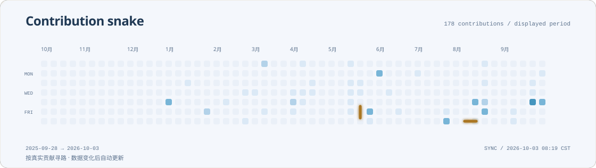
</picture>

 
 

<picture>
  <source media="(max-width: 640px)" srcset="./assets/footer-mobile.svg" />
  
</picture>

