<picture>
  <source media="(max-width: 640px)" srcset="./assets/hero-mobile.svg" />
  
</picture>

 
 

 

## 01 / 把想法做成产品

我是 **TFboy1**，一名 AI Native Builder。关注 Agent 协作、LLM 应用和 AI 开发工具，喜欢把实验性的想法做成能用的产品。

常用 **Vue + FastAPI**，从交互界面到后端服务一起构建。目前在探索：如何让人和多个 AI Agent 围绕同一个目标协作，让需求、任务和代码始终保持联系。

> **Version the intent, not just the code.** 
> 不只版本化代码，也版本化代码背后的意图。

## 02 / Vibe-Git

**AI-Native Collaboration for Teams**

Git 管理代码，**Vibe-Git 管理代码之上的协作**：把需求、任务、依赖和协作关系放进同一份上下文，让团队成员与多个 AI Agent 一起工作。

<a href="https://github.com/TFboy1/vibe-git">
  <picture>
    <source media="(max-width: 640px)" srcset="./assets/vibe-git-mobile.svg" />
    
  </picture>
</a>

**[进入 Vibe-Git →](https://github.com/TFboy1/vibe-git)**

## 03 / 正在构建的方向

- **Agent Systems** — 多 Agent 协作、共享上下文与任务编排。
- **LLM Applications** — 把模型能力接入具体的问题和工作流。
- **AI Developer Tools** — 让意图、开发过程与代码更紧密地连接。
- **Full-Stack Products** — 用 Vue 与 FastAPI 把想法做成完整产品。
- **Experimental AI Projects** — 试验新的交互方式、工具和协作模式。

## 04 / 工具箱

 
 

## 05 / 开源足迹

 
 

## 06 / Contribution snake

<picture>
  <source media="(prefers-color-scheme: dark)" srcset="https://raw.githubusercontent.com/TFboy1/TFboy1/output/github-contribution-grid-snake-dark.svg" />
  <source media="(prefers-color-scheme: light)" srcset="https://raw.githubusercontent.com/TFboy1/TFboy1/output/github-contribution-grid-snake.svg" />
  
</picture>

 
 

<picture>
  <source media="(max-width: 640px)" srcset="./assets/footer-mobile.svg" />
  
</picture>

