<picture>
  <source media="(max-width: 640px)" srcset="./assets/hero-mobile.svg" />
  
</picture>

[完整作品册 ↗](https://tfboyhomepage.netlify.app/) · [全部 GitHub 仓库 ↗](https://github.com/TFboy1?tab=repositories)

<!-- PROJECTS:START -->

## 01 / 置顶项目

<h3>academic-paper-writer</h3>

辅助论文研究、撰写、排版与文档输出的 Agent Skill，支持结构化流程和学校、会议的格式要求。

<code>AIGC · 论文 · 自动化</code>

<a href="https://github.com/TFboy1/academic-paper-writer"><kbd>GitHub ↗</kbd></a> &nbsp; <a href="https://github.com/TFboy1/academic-paper-writer/stargazers"><kbd>★ Stars 251</kbd></a> &nbsp; <a href="https://github.com/TFboy1/academic-paper-writer/forks"><kbd>⑂ Forks 14</kbd></a>

<h3>ChatGPT-Share-Gate</h3>

通过 Playwright 接管本地已登录的 ChatGPT 浏览器，结合 Telegram 和 Streamlit，为共享使用提供独立会话与请求排队。

<code>Playwright · Telegram · Streamlit</code>

<a href="https://github.com/TFboy1/ChatGPT-Share-Gate"><kbd>GitHub ↗</kbd></a> &nbsp; <a href="https://github.com/TFboy1/ChatGPT-Share-Gate/stargazers"><kbd>★ Stars 6</kbd></a> &nbsp; <a href="https://github.com/TFboy1/ChatGPT-Share-Gate/forks"><kbd>⑂ Forks 0</kbd></a>

<h3>oh-my-minimaxh3-director</h3>

MiniMax H3 驱动的全自动 AI 视频导演流水线：自动分镜、批量生成，再由剪映一键拼合。

<code>AIGC · 视频生成 · Codex Skill</code>

<a href="https://github.com/TFboy1/oh-my-minimaxh3-director"><kbd>GitHub ↗</kbd></a> &nbsp; <a href="https://github.com/TFboy1/oh-my-minimaxh3-director/stargazers"><kbd>★ Stars 142</kbd></a> &nbsp; <a href="https://github.com/TFboy1/oh-my-minimaxh3-director/forks"><kbd>⑂ Forks 20</kbd></a>

<h3>dsh-minecraft-ui</h3>

把 DeepSeek Harness 的工作空间变成 Minecraft 风格的方块世界，探索体素场景、装备模型并与 Agent 一起工作。

<code>DeepSeek Harness · Three.js · Agent UI</code>

<a href="https://github.com/TFboy1/dsh-minecraft-ui"><kbd>GitHub ↗</kbd></a> &nbsp; <a href="https://github.com/TFboy1/dsh-minecraft-ui/stargazers"><kbd>★ Stars 20</kbd></a> &nbsp; <a href="https://github.com/TFboy1/dsh-minecraft-ui/forks"><kbd>⑂ Forks 0</kbd></a>

<h3>vibe-git</h3>

给多人 Codex 开发一条协作协议：队长托管房间，成员在各自的 Git 工作区中提交提案、对齐任务并审核需求变更。

<code>Git · Codex · 协作协议</code>

<a href="https://github.com/TFboy1/vibe-git"><kbd>GitHub ↗</kbd></a> &nbsp; <a href="https://github.com/TFboy1/vibe-git/stargazers"><kbd>★ Stars 2</kbd></a> &nbsp; <a href="https://github.com/TFboy1/vibe-git/forks"><kbd>⑂ Forks 0</kbd></a> &nbsp; <a href="https://tfboy1.github.io/vibe-git/"><kbd>文档 ↗</kbd></a>

## 02 / 更多作品

展开其他 12 个作品 · 游戏与应用

### 游戏与互动世界

<h4>围住奶蛙</h4>

点一格，放下一点小心意。用蛋糕、奶茶和玩具，留下这只调皮的小奶蛙。

<code>游戏 · 解谜 · B站小玩具</code>

<a href="https://www.bilibili.com/toy/catch-naiwa/index.html"><kbd>试玩 ↗</kbd></a>

<h4>植物大战僵尸 · 职场版</h4>

在五天十关的办公室里种下植物，守住最后一分钟的下班自由。

<code>游戏 · 塔防 · B站小玩具</code>

<a href="https://www.bilibili.com/toy/preview/preview_lGpAC35t/index.html"><kbd>试玩 ↗</kbd></a>

<h4>群星警戒</h4>

自定义帝国、物种与伦理政体，在实时星海推演中写下独属于你的文明史。

<code>游戏 · 太空策略 · B站小玩具</code>

<a href="https://www.bilibili.com/toy/preview/preview_BNSPOAg7/index.html"><kbd>试玩 ↗</kbd></a>

<h4>Warchess · 东方战争沙盘</h4>

融合据点争夺、军令资源与增援机制的中国象棋战术对战。

<code>游戏 · 策略 · B站小玩具</code>

<a href="https://www.bilibili.com/toy/preview/preview_cJ2s4j5t/index.html"><kbd>试玩 ↗</kbd></a>

<h4>梗决斗师</h4>

盖下陷阱、发动魔法，在复古论坛街机风的热梗卡牌对决中一路闯关。

<code>游戏 · 卡牌 · B站小玩具</code>

<a href="https://www.bilibili.com/toy/preview/preview_Lnrx9HhN/index.html"><kbd>试玩 ↗</kbd></a>

<h4>梗可梦</h4>

五只热梗精灵组成三人小队，闯过三幕回合制肉鸽路线。

<code>游戏 · 回合制肉鸽 · B站小玩具</code>

<a href="https://www.bilibili.com/toy/meme_monsters/index.html"><kbd>试玩 ↗</kbd></a>

<h4>万象轮回</h4>

从主神空间穿越无限位面，调查、生活、战斗，并写下只属于你的编年史。

<code>游戏 · 角色扮演 · B站小玩具</code>

<a href="https://www.bilibili.com/toy/preview/preview_MvGkkxx6/index.html"><kbd>试玩 ↗</kbd></a>

<h4>别饿着奶蛙</h4>

割一根绳，接一段小小的意外。十个绘本物理谜题，二十种奶蛙日常。

<code>游戏 · 物理解谜 · B站小玩具</code>

<a href="https://www.bilibili.com/toy/preview/preview_7UwaGRvQ/index.html"><kbd>试玩 ↗</kbd></a>

### 应用与日常工具

<h4>AutoList</h4>

基于艾森豪威尔四象限的待办 App，支持 AI 自动分类、本地提醒和 Android 桌面小组件。

<code>应用 · 待办 · AIGC</code>

<a href="https://github.com/TFboy1/AutoList"><kbd>GitHub ↗</kbd></a> &nbsp; <a href="https://github.com/TFboy1/AutoList/stargazers"><kbd>★ Stars 0</kbd></a> &nbsp; <a href="https://github.com/TFboy1/AutoList/forks"><kbd>⑂ Forks 0</kbd></a> &nbsp; <a href="https://github.com/TFboy1/AutoList/releases/tag/v1.0.1"><kbd>下载 ↗</kbd></a>

<h4>WittyDiary</h4>

AIGC 日记应用，带有类似“死了么”的日常确认功能。

<code>日记 · AIGC · 应用</code>

<a href="https://wittydiary.onrender.com/"><kbd>打开 ↗</kbd></a>

<h4>MITI · 角色人格测试</h4>

用 Vue + Vite 构建的米哈游角色人格测试：通过五维回答结果，匹配最接近的角色卡。

<code>Vue · Vite · 人格测试</code>

<a href="https://github.com/TFboy1/MITI"><kbd>GitHub ↗</kbd></a> &nbsp; <a href="https://github.com/TFboy1/MITI/stargazers"><kbd>★ Stars 0</kbd></a> &nbsp; <a href="https://github.com/TFboy1/MITI/forks"><kbd>⑂ Forks 0</kbd></a> &nbsp; <a href="https://miti-fp90.onrender.com/"><kbd>打开 ↗</kbd></a>

<h4>ClipFlow（剪切流）</h4>

跨平台剪贴板超级中转站。

<code>安卓 · 网页</code> · <strong>正在打磨</strong>

<a href="https://tfboyhomepage.netlify.app/"><kbd>作品介绍 ↗</kbd></a>

<!-- PROJECTS:END -->

## 03 / 把时间留给创造

我是 **TFBOY / TFboy1**，一名独立开发者。做 AI 自动化与开发工具，也做小游戏和让日常轻松一点的应用。把重复的事情交给工具，把省下来的时间留给好奇心。

常用 **Vue + FastAPI**，也会根据作品选择 **Python、TypeScript、React Native 和 Three.js**。

> 让世界更加自动化，也更有趣。

## 04 / Contribution snake

每一格来自真实 GitHub 贡献记录，金色星芒会根据有贡献的日期和次数重新寻路。每 5 分钟检查数据源，数据变化后自动更新；GitHub 调度与图片缓存可能有延迟。图中保留日期、贡献次数和数据快照更新时间。

<picture>
  <source media="(prefers-color-scheme: dark)" srcset="./assets/github-contribution-grid-snake-dark.svg?v=2d962e071d5b" />
  
</picture>
